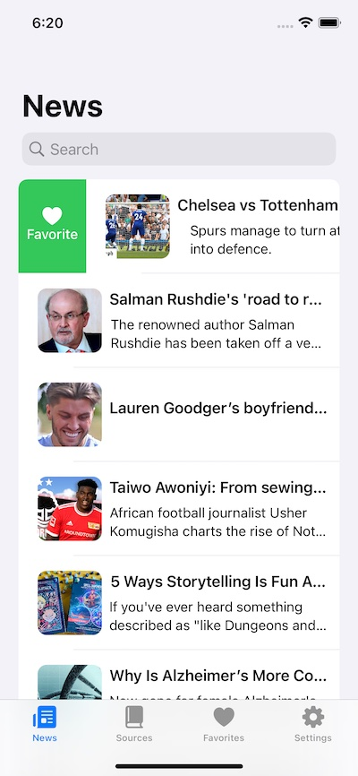
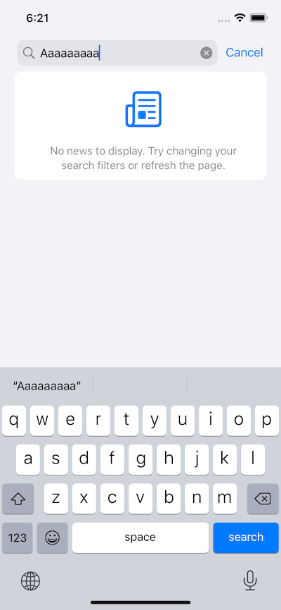
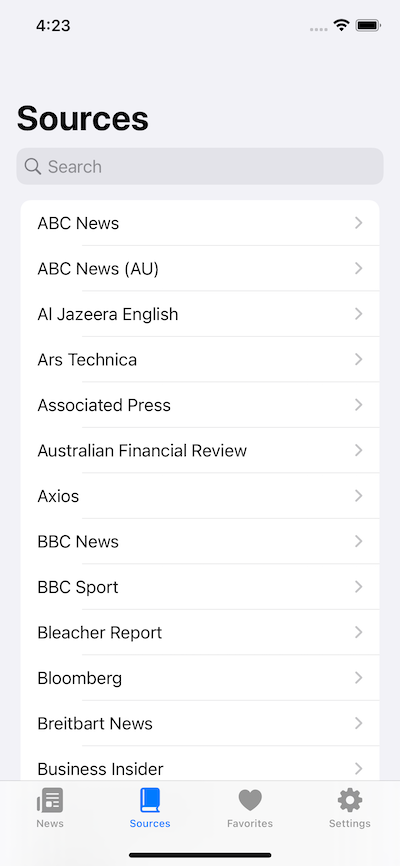
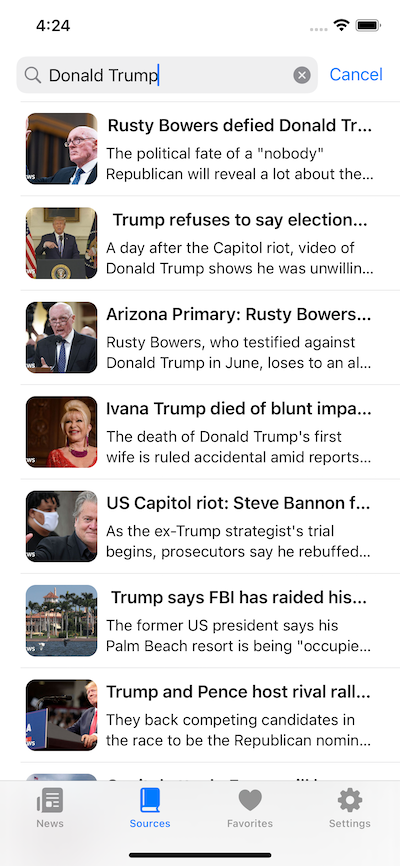
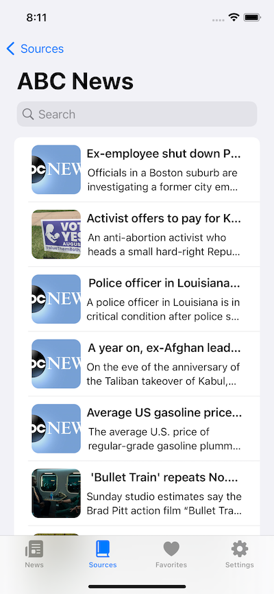
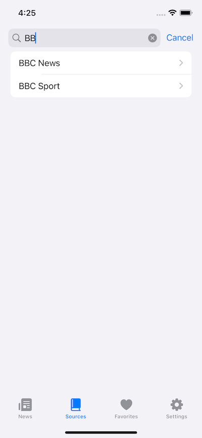
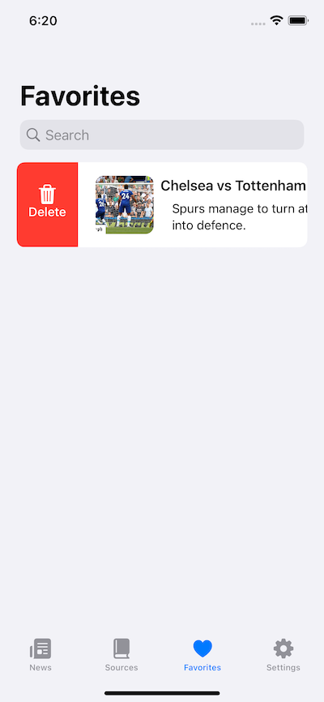
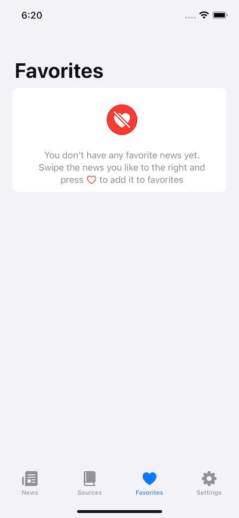
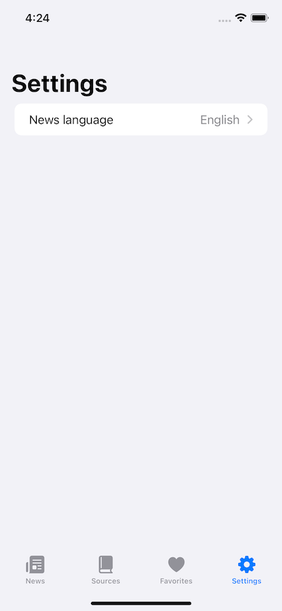
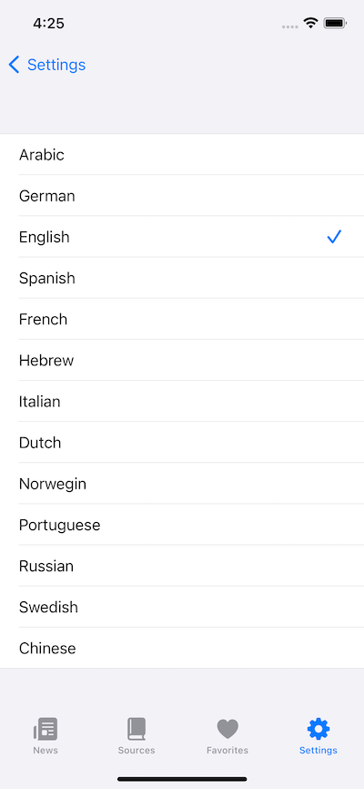

# NewsApp

iOS client for [NewsAPI.org](https://newsapi.org) based on Swift.

## Features

- Loading screen with animation.
- Fetch top news.
- Infinite scrolling.
- Change news language. The selected language will be saved when you reload the application.
- Saving news to bookmarks. The selected news will be saved when you reload the application.
- Read article in a Webview in sheet presentation.
- Search news from all source or from selected.
- Search news saved in favorites.
- Search source.

## Installing

- Visit [NewsAPI.org](https://newsapi.org) to get your API Key
- Paste the key in APIConstants.swift file.

```swift
static let apiKey = "API"
```

## Built With

* SwiftUI
* CoreData
* LottieFiles

## Demo

<p>










</p>

## Resources

Animation - [Lottiefiles resources](https://lottiefiles.com/105150-our-news)

Icon - [Sketchappsources](https://www.sketchappsources.com/free-source/1404-ios9-news-icon-sketch-freebie-resoource.html)

## License

GNU General Public License v3.0
